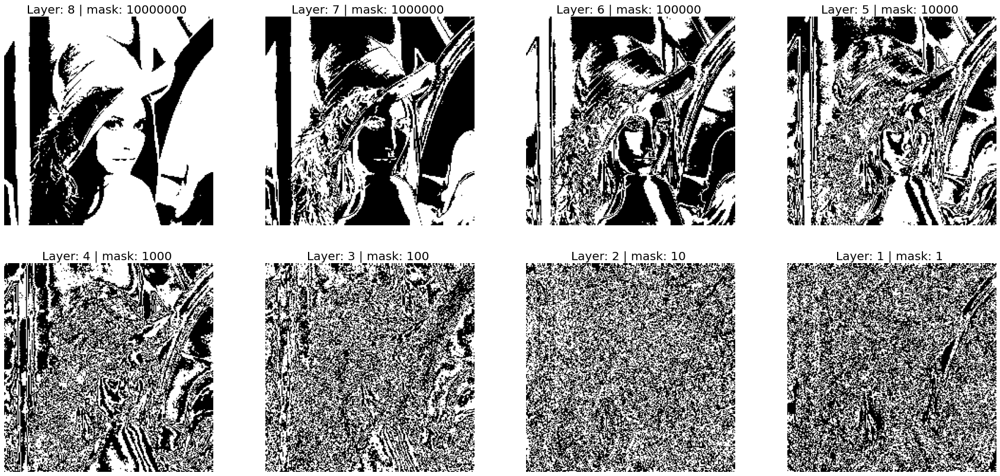
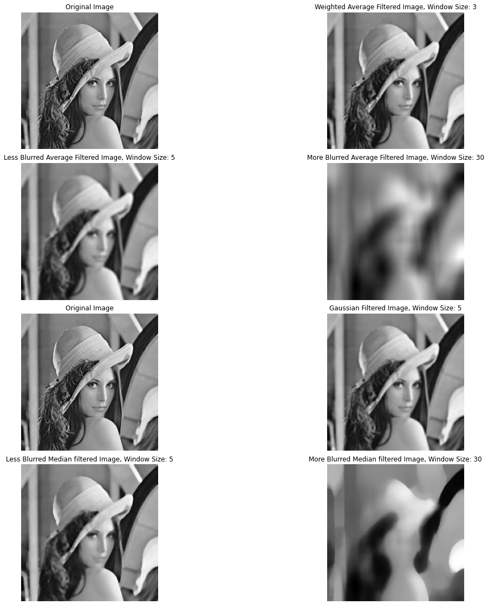
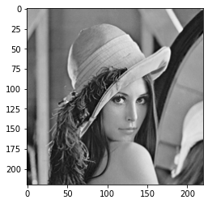
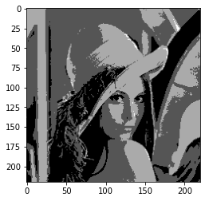

# Image-Processing-Matrix-Operations

- Edge
  - Sobel 
  - Laplacian
- Histogram
  - Average Filter
  - Weighted Average Filter
  - Gaussian Filter
- Noise Removal
- Image Resizing
  - Reduction 50,80,90%
  - Skipping Pixels
- Bit Plane 

